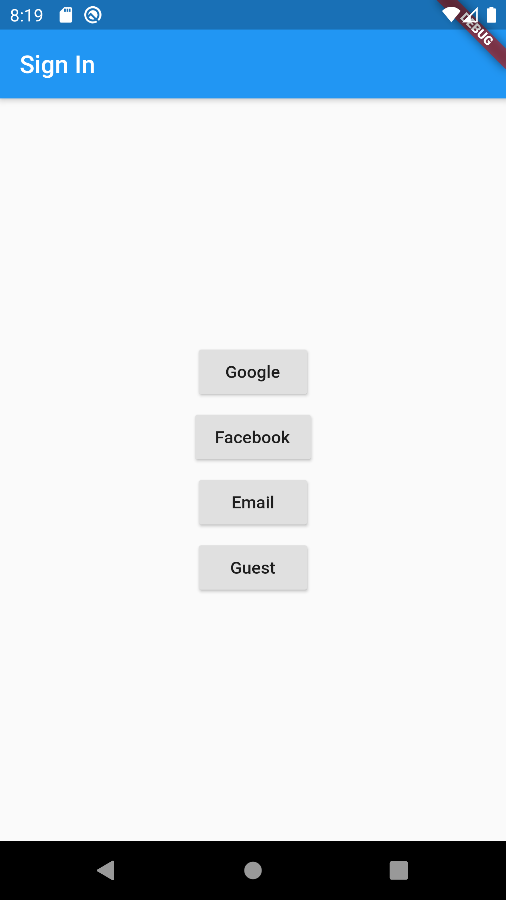
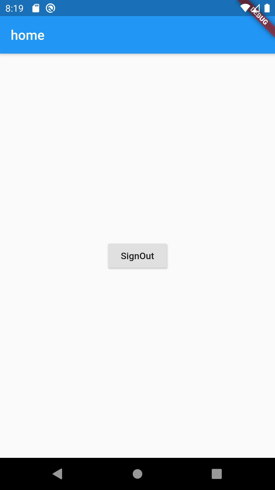

# Flutter Firebase Authentication

Flutter Firebase authentication example with Provider.

### Supported sign-in methods

- [x] Anonymous
- [x] Email & Password
- [ ] Email link (passwordless) (see [documentation](docs/sign-in-email-link.md))
- [x] Facebook
- [ ] GitHub
- [x] Google
- [ ] Apple
- [ ] Phone
- [ ] Twitter

## Preview

## Running the project with Firebase

To use this project with Firebase authentication, some configuration steps are required.

- Create a new project with the Firebase console.
- Add iOS and Android apps in the Firebase project settings.
- On Android, use `com.smsofttech.carfix` as the package name (a SHA-1 certificate fingerprint is also needed for Google sign-in).
- then, [download and copy](https://firebase.google.com/docs/flutter/setup#configure_an_android_app) `google-services.json` into `android/app`.
- On iOS, use `com.codingwithflutter.firebaseAuthDemo` as the bundle ID.
- then, [download and copy](https://firebase.google.com/docs/flutter/setup#configure_an_ios_app) `GoogleService-Info.plist` into `iOS/Runner`, and add it to the Runner target in Xcode.

See this document for full instructions:

- [https://firebase.google.com/docs/flutter/setup](https://firebase.google.com/docs/flutter/setup) 

Additional setup instructions for Google and Facebook sign-in:

- Google Sign-In on iOS: [https://firebase.google.com/docs/auth/ios/google-signin](https://firebase.google.com/docs/auth/ios/google-signin)
- Google Sign-In on Android: [https://firebase.google.com/docs/auth/android/google-signin](https://firebase.google.com/docs/auth/android/google-signin)
- Facebook Login for Android: [https://developers.facebook.com/docs/facebook-login/android](https://developers.facebook.com/docs/facebook-login/android)
- Facebook Login for iOS: [https://developers.facebook.com/docs/facebook-login/ios](https://developers.facebook.com/docs/facebook-login/ios)

## [License: MIT](https://github.com/salscoding/flutter-firebase-authentication/blob/master/LICENSE)
